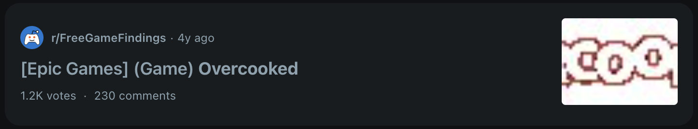

# FreeGameNotifier

This project is an unofficial chrome extension to check updates from [reddit.com/r/FreeGameFindings](https://www.reddit.com/r/FreeGameFindings)

It utilizes the following Chrome Extension permissions:

- `Alarm`, to check for updates periodically
- `Storage`, to save settings & last claimed & refreshed dates

#### Video Demo: <URL HERE>

# Installation

1. Enable Developer Mode on Chrome:

   - Open this [link](chrome://extensions/) or navigate to Menu > More Tools > Extensions in Chrome.
   - Toggle on Developer Mode in the top-right corner.

2. Load the Extension:

   - Click on `Load unpacked`
   - Select the folder containing your extension’s manifest.json file.

# Usage

This extension notifies you of the number of new posts (excluding expired) since your last claimed date via the extension badge.

Currently, the extension retrieves updates every 2 hours.
To retrieve the latest updates manually, press the `refresh` button.

## WorkFlow

1. **Open Free Game Findings**  
   Click the Reddit button to open [reddit.com/r/FreeGameFindings](https://www.reddit.com/r/FreeGameFindings) in a new tab.

2. **Check and Claim Your Games**  
   Review the available games and claim any that interest you.

3. **Update Your Claim Status**  
   After you’ve finished checking and claiming, click the **Claimed** button to record the date of your last claim.

4. **Repeat from Step 1 for updates**  
   You check the extension badge now instead of checking the subreddit every time for new updates.

## Notification Filter Setting

 
In the Notification Filter, you may filter through platforms.

The **Platform** is the first section in the Reddit post title listed in square brackets.

For example:

`Epic Games` is the **Platform** in this post title:

 
 

To filter multiple platforms, separate each platform with a comma like so:

Eg: `Xbox,Playstation,PS`

You may choose to either:

- ### Include All Games Except Specified Platforms

  By using a filter such as `xbox`, you will exclude posts that are only tagged with the `xbox` platform.

  However, posts that include other platforms (e.g., `PC / Xbox` ) will still be included to ensure you don't miss important updates. To completely exclude such posts, you’ll need to filter out all relevant platforms.

- ### Exclude All Games Except Specified Platforms

  Using a filter like `steam` will limit the notifications to only those posts that are tagged with the `steam` platform.

### Excluding PSA Tag

You may exclude the `PSA` tag too by using it in the filters.

Eg: `Xbox,Playstation,PSA`

The definition of the `PSA` tag, according to the [subreddit rules](https://www.reddit.com/r/FreeGameFindings/wiki/rules/):

   Subreddit Rules

> 7.If the offer you're posting isn't avilable yet, or is scheduled for later, you cannot post it. There can be exceptions for times where you need to do something prior to prepare or something like that.

>12. PSAs for Related Content Are Allowed
Our above rules exclude and remove a lot of content from being posted on FGF, but often times there are things that might be relevant to the FGF community, that wouldn't fit within the ruleset. Reminders of the latest Amazon Prime free game promotions wouldn't really be free, but it is relevant to a lot of the community. So on a case-by-case basis, things like that, and some other items are fine to post as [PSA].

 

While, `PSA` can mean many things, in the past, the `PSA` tag refers to:

- **Games that will be free on a future date**

   > [PSA] Watch_Dogs 2 Will Be Free To Claim July 12th
- **Games that become F2P**
   > [PSA] Vigor is now F2P

- **Game/Platform Collectibles**
   > [PSA] Steam Winter Sale 2023 - Trading Cards & Stickers

- **Games that are free under certain conditions**
   > [PSA] Quake is complimentary with Amazon Prime Gaming

- **Updates / Announcements**
   > [PSA] Xbox 360 Marketplace is closing forever on July 29, claim what you want to claim today

 

## Post Type Settings

The **Post Type** is the second section in the Reddit post title listed in round brackets.

For example:

`Game` is the **Post Type** in the following post:

 
 

These are the following Post Types we check for:
- Games
- DLCs
- Memberships
- Game Credits
- Alpha/Beta releases
- Others (Usually in-game items & everything else )

If there is no platform tag in a post title, we also categorize it as `Others`

> Exiled Giveaways and Itch.io Mega Threads

# Technical Details

On installation, we call `createNewGameAlarm` to create an recurring alarm to retrieve updates periodically from the subreddit.

Our main logic resides in `scripts/background/getLatestFreeGamesFindingsData`, in which we will fetch the latest game updates & filter through them according to the filter settings.

# File Structure

- **/css** - CSS stylesheets folder
- **/docs** - files for documentation only
- **/icons** - icons, images used for pages, components, etc
- **/pages** - HTML pages for the extension
- **/scripts** - Our JS extension code
   - **background.js**, the main JS script running in the background
   - **constants.js**, to store constants for filters & postType
   - **menupanel.js**, to store code related to the extension menu
   - **service-worker.js**, to import background.js
   - **settings.js**, to store code related to the extension settings
   <!-- - **utils.js**, to store commonly re-used functions/data -->
   <!-- We can store the names of storageKeys here so they are easy to rename in the future, such as lastClaimedDateStorageKey -->

# Credits

- Google Fonts Icons, https://fonts.google.com/icons

- FreeGameFindings Reddit Community & Logo, https://www.reddit.com/r/FreeGameFindings/
