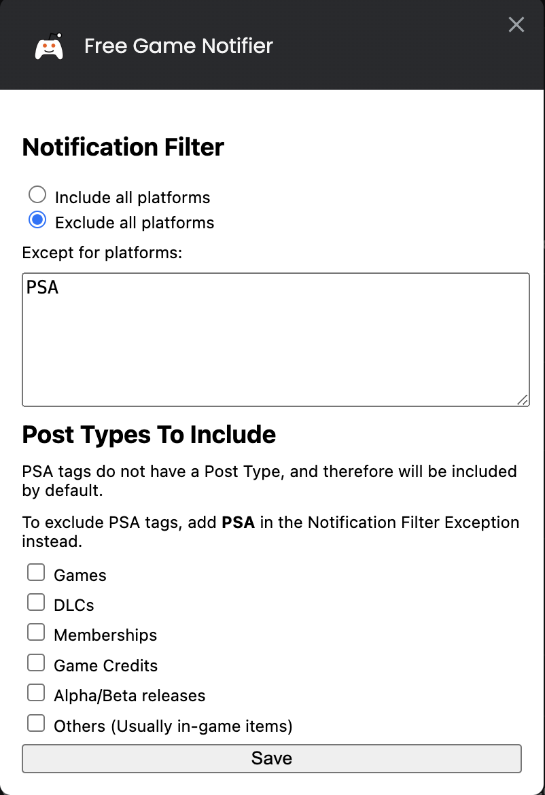

# Free Games Notification Extension

#### Video Demo: <URL HERE>

## About

This project is an unofficial extension to check updates from [reddit.com/r/FreeGameFindings](https://www.reddit.com/r/FreeGameFindings)

It utilizes the following Chrome Extension permissions:

- `Alarm`, to check for updates periodically
- `Storage`, to save settings & last claimed & refreshed dates

# Installation

1. Enable Developer Mode on Chrome:

   - Open this [link](chrome://extensions/) or navigate to Menu > More Tools > Extensions in Chrome.
   - Toggle on Developer Mode in the top-right corner.

2. Load the Extension:

   - Click on `Load unpacked`
   - Select the folder containing your extension’s manifest.json file.

# Usage

This extension notifies you of the number of new posts (excluding expired) since your last claimed date via the extension badge.

Currently, the extension retrieves updates every 2 hours.
To retrieve the latest updates manually, press the `refresh` button.

### WorkFlow

1. **Open Free Game Findings**  
   Click the Reddit button to open [reddit.com/r/FreeGameFindings](https://www.reddit.com/r/FreeGameFindings) in a new tab.

2. **Check and Claim Your Games**  
   Review the available games and claim any that interest you.

3. **Update Your Claim Status**  
   After you’ve finished checking and claiming, click the **Claimed** button to record the date of your last claim.

### Notification Filter Setting

To filter multiple platforms, separate each platform with a comma like so:

Eg: `Xbox,Playstation,PSA`

You may choose to either:

- ### Include All Games Except Specified Platforms

  By using a filter such as `xbox`, you will exclude posts that are only tagged with the `xbox` platform.

  However, posts that include other platforms (e.g., `PC / Xbox` ) will still be included to ensure you don't miss important updates. To completely exclude such posts, you’ll need to filter out all relevant platforms.

- ### Exclude All Games Except Specified Platforms

  Using a filter like `steam` will limit the notifications to only those posts that are tagged with the `steam` platform.

# Credits

- Google Fonts Icons, https://fonts.google.com/icons

- FreeGameFindings Reddit Community & Logo, https://www.reddit.com/r/FreeGameFindings/
